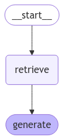
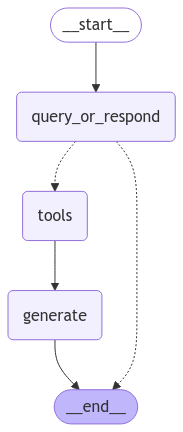
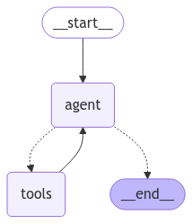

# Retrieval-Augmented Generation (RAG) Implementation

This repository contains two implementations of Retrieval-Augmented Generation (RAG):

- **Minimal Implementation:** A simple and lightweight RAG setup (no history memory just QA).
- **Multi-Step Retrieval:** An advanced RAG approach using multi-step retrieval for improved response generation with memory persistence.

## Features

- **Efficient Document Retrieval:** Uses vector-based search to find relevant information.
- **Multi-Step Reasoning:** Retrieves and refines context across multiple steps.
- **Optimized for LLMs:** Enhances large language models with real-world knowledge.
- **Minimal Setup:** Easy to run with pre-defined dependencies.
- **LangSmith Debugging & Monitoring:** Integrated with LangSmith for tracing API calls.
- **GROQ API Support:** Uses `llama3-8b-8192` via GROQ API for inference.

## Installation

Ensure you have Python installed (recommend **Python 3.10**). Clone the repository and install dependencies:

```bash
git clone https://github.com/Chebil-Ilef/RAG-Langchain
cd RAG-Langchain
pip install -r requirements.txt
```

## Usage

Run the Jupyter notebooks to experiment with different RAG implementations:```

## Dependencies

All required dependencies are listed in `requirements.txt`. It includes packages for:
- **Vector Search:** FAISS, ChromaDB, ect  or simply langchain vector store.
- **LLMs:** OpenAI API, Hugging Face Transformers, GROQ API
- **Notebook Execution:** Jupyter
- **Debugging & Monitoring:** LangSmith
- **Sequence App Execution:** Langgraph

## API Keys Setup

Both notebooks require API keys for LangSmith and GROQ. To set them up, run:
```python
import getpass
import os

os.environ["LANGSMITH_TRACING"] = "true"
if not os.environ.get("LANGSMITH_API_KEY"):
  os.environ["LANGSMITH_API_KEY"] = getpass.getpass("Enter API key for langsmith: ")

if not os.environ.get("GROQ_API_KEY"):
  os.environ["GROQ_API_KEY"] = getpass.getpass("Enter API key for groq: ")
```

## Graphs





## Contribution

Feel free to open issues, submit PRs, or suggest improvements!

## License

This project is licensed under the MIT License.


